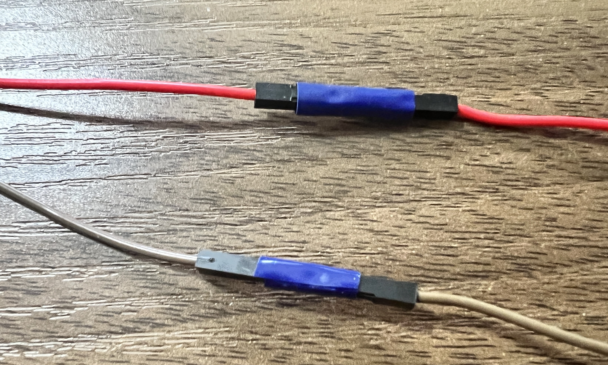

Je hebt mogelijk extra lange draden nodig om je component te bevestigen (bijvoorbeeld LED, knop of zoemer) aan je Raspberry Pi-pinnen. Dit doe je door draden met elkaar te verbinden met een zogenaamde 'daisy chain' techniek'. Om bijvoorbeeld een extra lange bus-bus draad te maken, bevestig je een pin-bus draad aan een bus-bus verbindingsdraad.

**Tip:** houd de kleur van de draad hetzelfde zodat je gemakkelijk kunt zien welke draad aan welke Raspberry Pi pin is verbonden.

Het probleem met deze methode is dat de draden vaak losraken. Je kunt een klein stukje tape gebruiken om de verbinding te verstevigen.

